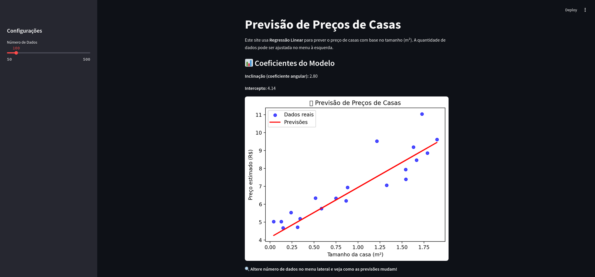

# Previsão de Preços de Casas com Regressão Linear

Este projeto utiliza **Regressão Linear** para prever o preço de casas com base no tamanho (m²).
A aplicação é desenvolvida com **Streamlit** e permite ao usuário **ajustar a quantidade de dados** e visualizar as previsões de forma interativa.

---

## Exemplo da Aplicação



---

## Estrutura do projeto

```markdown
├── app/
│   ├── datasets/        # Armazena os datasets gerados
│   ├── ipynb/           # Rascunhos em Jupyter Notebook
│   ├── gerarDataset.py  # Script para a geração de dataset fictício
│   └── main.py          # Aplicação principal em Streamlit
├── .gitignore
├── README.md
└── requirements.txt     # Dependências do projeto
```

---

## Tecnologias utilizadas

- **[Streamlit](https://streamlit.io/)** ➝ Criar a interface web interativa.  
- **[NumPy](https://numpy.org/)** ➝ Gerar dados fictícios aleatórios.  
- **[Matplotlib](https://matplotlib.org/)** ➝ Criar gráficos de visualização.  
- **[Scikit-learn](https://scikit-learn.org/)** ➝ Treinar o modelo de regressão linear.  

---

## Como executar

1. Clone o repositório:
```bash
git clone https://github.com/seu-usuario/nome-do-repositorio.git
cd nome-do-repositorio
```

2. Instale as dependências:
```bash
pip install -r requirements.txt
```

3. Execute a aplicação:
```bash
streamlit run app.py
```
> O Streamlit abrirá automaticamente no navegador.

---

Fique à vontade para modificar e expandir o projeto! 🚀